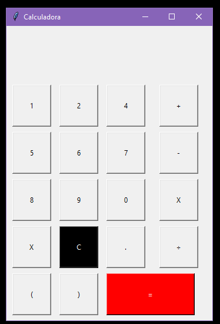

# Calculadora Simples em Tkinter 🧮

Esta é uma calculadora simples implementada em Python usando a biblioteca Tkinter para a interface gráfica.



## Funcionalidades

- Realiza operações de adição, subtração, multiplicação e divisão.
- Suporta operações com números decimais.
- Permite a utilização de parênteses para realizar operações prioritárias.
- Exibe o resultado da expressão em tempo real.
- Limpa a expressão com o botão "C" e exibe "E R R O" em caso de erro na avaliação da expressão.

## Como Usar 🚀

1. Clone o repositório:

   ```bash
   git clone https://github.com/seu-usuario/calculadora-tkinter.git
   ```

2. Navegue até o diretório do projeto:

   ```bash
   cd calculadora-tkinter
   ```

3. Execute o script:

   ```bash
   python calculadora.py
   ```

## Personalização 💅

Você pode personalizar a interface gráfica e o comportamento da calculadora adicionando ou removendo botões e funcionalidades no código-fonte. Sinta-se à vontade para explorar e adaptar o código conforme suas necessidades.

## Autor 👔

Este projeto foi desenvolvido por [Ródiney Wanderson](https://github.com/rodineyw).

## Licença 🪪

Este projeto está licenciado sob a [Licença MIT](LICENSE).
